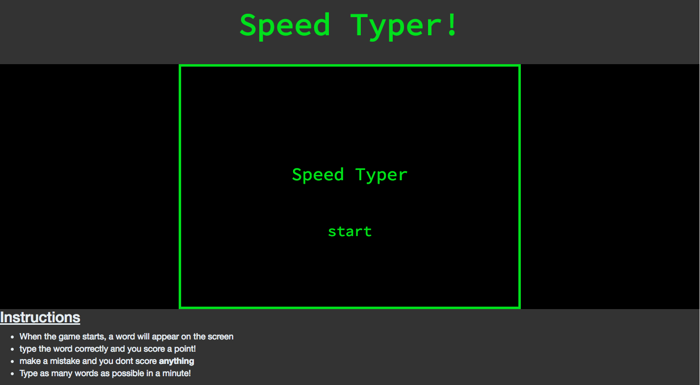
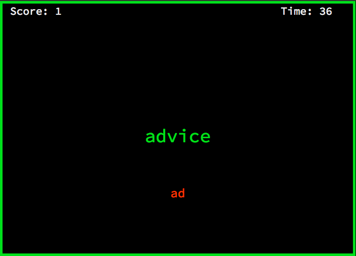

# Sparta Project 1
##Description
The aim of this project is to build a game of my choice in a week, with an __MVP__ (Minimum Viable Product) due wednesday at 11:00am.

The game I decided to create is a speed typing game. In the game, the player has 60 seconds to type as many words as possible. If they type a word correctly they score a point, but if they make a mistake they don't score anything.




##Languages used

- HTML
- CSS
- Javascript

##How to download
1. If you do not have git installed follow this [guide](https://gist.github.com/derhuerst/1b15ff4652a867391f03)
2. In your browser, navigate to this [page](https://github.com/DavidSIJames/sparta_project1)
3. Open your Terminal and navigate to where you want to clone the repo.
4. Once there, enter the following command to clone the repo:

	```terminal
	git clone git@github.com:DavidSIJames/sparta_project1.git
	```
5. Once the repo has been cloned, cd into it using this command

	```terminal
	cd sparta_project1
	```
6. You are now in the repo

#### You can view the page [here](https://davidsijames.github.io/Sparta_project1/)
##Challenges
The biggest challenge I came across was to receive information from an API. We haven't covered APIs or how to receive information from them yet, so I had to do research on how to use them. 

The second biggest challenge was finding a way to compare key presses. It looked like an impossible problem, but once I broke it down into smaller steps, it was much easier to work through.  
## Take Away
Overall, this project was a lot less difficult and scary than I thought it would be. Building the webpage with the css took about an hour, and the game itself took a day to build.

I am exteremly happy with how this project went. The only thing I would change is the length of my correct and incrorrect sounds, as they go on for slightly too long which causes the sound not to play if the user gets two correct or incorrect words in a row.


